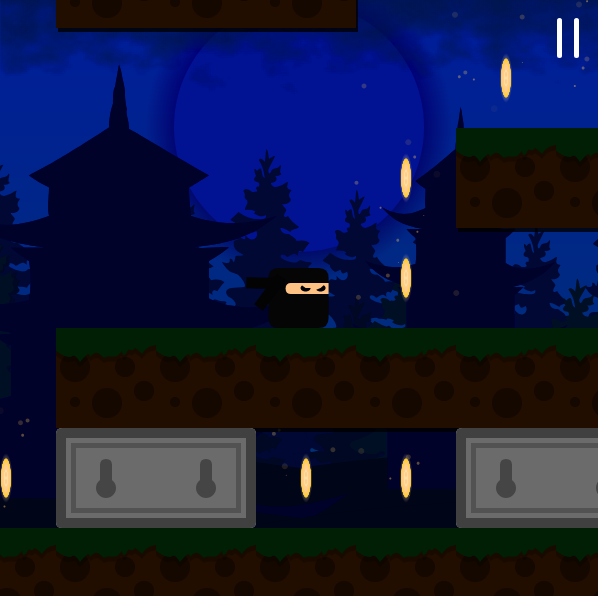
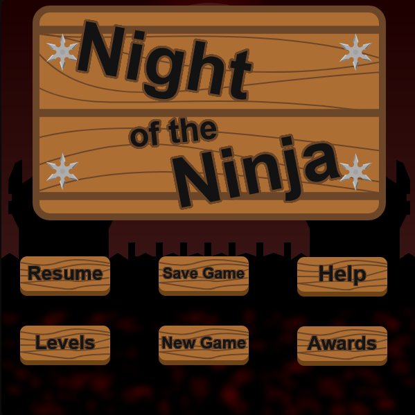
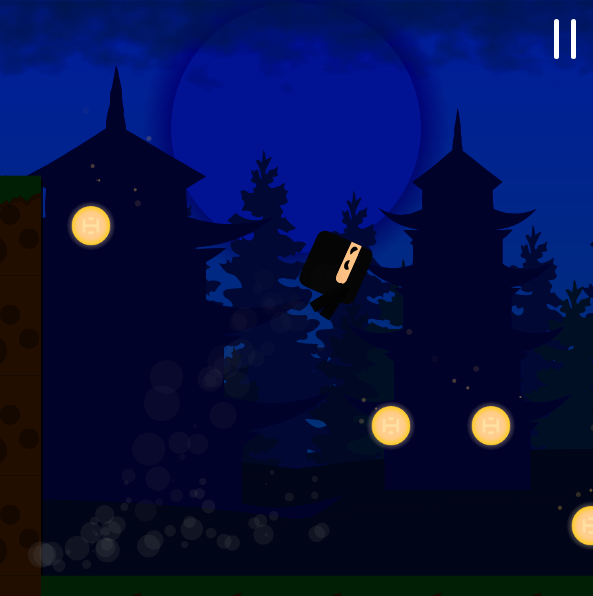

# Night of the Ninja

A ninja platformer across thirty levels of forest, cave and castle. Dash
through walls, throw shuriken, unlock doors, feed the sad monsters, and try
not to fall off anything. Twenty-four achievements, a shop, and a save code
you can print out and paste back in.

|  |  |  |
| :---: | :---: | :---: |
|  |  |  

Originally written in Khan Academy ProcessingJS in 2018 by **CoC's
Firefists** — Corin Fist and Link. This version runs the same program in a
browser on a plain HTML5 canvas.

The game code is the 2018 original, byte for byte. What was added is the
environment around it: `ka.js` reimplements the Khan Academy ProcessingJS
dialect against canvas 2D, and `tools/convert.js` applies three documented
edits to strip Khan Academy's own scaffolding.

---

## Play

[Play Here!](https://RobertCloudDev-cloud.github.io/night-of-the-ninja/)

---

## Controls

| Input | Action |
|---|---|
| **W A S D** or arrow keys | Move and jump |
| **Click** | Throw a weapon toward the cursor |
| **Space** | Dash — goes through walls |
| **E** | Hold to reveal your stats |
| **Pause button** (top right) | Pause, shop, level select |

You start with three weapons in stock; they return to you once they hit
something or expire. Coins buy upgrades in the shop. Keys open doors. Meat
turns an angry monster friendly.

---

## Layout

| File | Contents |
|---|---|
| `index.html` | The page: canvas, scaling, and error reporting |
| `ka.js` | Khan Academy ProcessingJS dialect on canvas 2D — degrees-based trig, `beginShape`/`bezierVertex`/`curveVertex`, `get()`/`PImage.mask()`, Processing's Perlin noise |
| `runtime.js` | Program lifecycle: global mode, the draw loop, KA's input model, touch support |
| `game.js` | The game, generated from the original by `tools/convert.js` |
| `tools/convert.js` | Applies the three documented edits; refuses to write on any mismatch |
| `tools/harness.js` | Runs the shim headlessly for testing |
| `tools/verify-art.js` | Artwork transcribed from the original, used to verify the shim |

---

Original game © 2018 CoC's Firefists.
